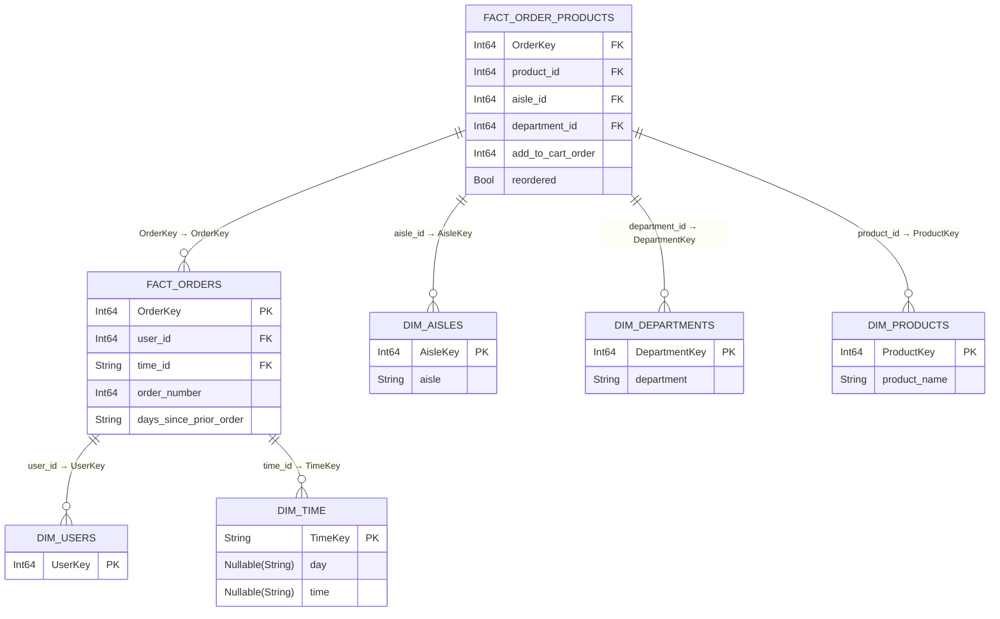

<div align="center">

# Instacart Market Basket Analysis

## Re: Group 5

</div>


---

# Table of Contents

- [Project Overview](#-about-the-project)
  - [Dataset Used](#dataset-used)
  - [Goal of the Exercise](#goal-of-the-exercise)
  - [Team Setup](#team-setup)
  - [Environment Setup](#environment-setup)
- [Architecture & Workflow](#architecture--workflow)
  - [Pipeline Flow](#pipeline-flow)
  - [Tools Used](#tools-used)
  - [Medallion Architecture](#medallion-architecture)
- [Modeling Process](#modelling-documentation)
  - [Source Structure](#source-structure)
  - [Star Schema Design](#star-schema-design)
  - [Challenges](#challenges)
- [Collaboration & Setup](#collaboration--setup)
  - [Task Splitting](#task-splitting)
  - [Shared vs Local Work](#shared-vs-local-work)
  - [Best Practices Learned](#best-practices-learned)
- [Business Questions & Insights](#business-questions--insights)
  - [Business Questions Explored](#business-questions-explored)
  - [Dashboards / Queries](#dashboards--queries)
  - [Key Insights](#key-insights)

---

## 🌟 About the Project

This project uses the **Instacart Market Basket Analysis**, which contains anonymized information on over 3 million orders from 200,000+ users

### Dataset Used
Online grocery dataset (**InstaCart**)

### Goal of the Exercise
Transform the raw dataset into a dimensional star schema (fact and dimension tables) for analytics, implement data quality checks, and explore insights with Metabase dashboards

### Team Setup
- **Collaboration style**: divided tasks into ingestion, modeling, visualization, and documentation
- **GitHub** used for version control

### Environment Setup
- Shared **Docker containers** for ingestion and dbt builds
- Local laptops for development and testing
- Sync via shared configs and Git

---

## ⚙️ Architecture & Workflow

### Tools Used
- **Ingestion:** dlt (done by Sir Myk)
- **Modeling and DQ checks:** dbt  
- **Visualization:** Metabase  
- **Collaboration:** Git + GitHub

### Medallion Architecture
- This exercise uses the same Medallion Architecture: the Raw → Clean → Mart table transformations.
- The raw tables is the ingested dataset.
- The clean tables are transformed from the clean tables through data typecasting, ensuring that the id fields are not nullable, and generally ensuring that the data is ready for mart.
- The mart is the final tables ready for front-end users, the fields are organized and distributed according to the star schema and the time table is created for easier time analysis of the dataset.
---

## 📊 Modelling Process

Goal is to design a star schema:
- **Fact tables**: order activity and product behavior (purchase frequency, reorder rates, and item sequence within orders)
- **Dimension tables**: descriptive attributes, connected to fact tables (with surrogate keys where possible)

---

## Fact Tables

### `fact_orders`
> Tracks each order by user, including timing and sequence

| Column Name            | Data Type | Notes / Links |
|------------------------|-----------|---------------|
| OrderKey               | Int64     |               |
| user_id                | Int64     |               |
| order_number           | Int64     |               |
| time_id                | String    |               |
| days_since_prior_order | String    |               |

---

### `fact_order_products`
> Stores products linked to orders, showing aisle, department, and reorder info

| Column Name        | Data Type | Notes / Links          |
|-------------------|-----------|----------------------|
| OrderKey           | Int64     | Primary Key (PK)     |
| product_id         | Int64     | Foreign Key (FK)     |
| aisle_id           | Int64     | Foreign Key (FK)     |
| department_id      | Int64     | Foreign Key (FK)     |
| add_to_cart_order  | Int64     | N/A                  |
| reordered          | Bool      | N/A                  |

---

## Dimension Tables

### `dim_aisles`
> Lists all aisles with unique IDs

| Column Name | Data Type | Notes / Links      |
|------------|-----------|------------------|
| AisleKey   | Int64     | Primary Key (PK) |
| aisle      | String    | N/A              |

---

### `dim_departments`
> Lists all departments with unique IDs

| Column Name    | Data Type | Notes / Links      |
|---------------|-----------|------------------|
| DepartmentKey | Int64     | Primary Key (PK) |
| department    | String    | N/A              |

---

### `dim_products`
> Lists all products with unique IDs and names

| Column Name   | Data Type | Notes / Links      |
|--------------|-----------|------------------|
| ProductKey   | Int64     | Primary Key (PK) |
| product_name | String    | N/A              |

---

### `dim_time`
> Maps order times to days and timestamps

| Column Name | Data Type         | Notes / Links      |
|------------|-----------------|------------------|
| TimeKey    | String          | Primary Key (PK) |
| day        | Nullable(String)| N/A              |
| time       | Nullable(String)| N/A              |

---

### `dim_users`
> Lists all users with unique IDs

| Column Name | Data Type | Notes / Links      |
|------------|-----------|------------------|
| UserKey    | Int64     | Primary Key (PK) |

---

## Relationships

### fact_orders
- **user_id** → `regrp5_insta_dim_users.UserKey`
- **time_id** → `regrp5_insta_dim_time.TimeKey`
- **order_number** → sequence of orders per user
- **days_since_prior_order** → gap since previous order

### fact_order_products
- **order_key** → `fact_orders.OrderKey`
- **product_id** → `regrp5_insta_dim_products.ProductKey`
- **aisle_id** → `regrp5_insta_dim_aisles.AisleKey`
- **department_id** → `regrp5_insta_dim_departments.DepartmentKey`
- **add_to_cart_order** → position in order
- **reordered** → indicates if product was reordered

### Quick Takeaways
- Fact tables **track orders and products**, including timing and reorder info
- Dimension tables provide **context**: users, products, aisles, departments, and time
- `dim_time` is normalized from numeric day/hour to standard day/time for easier analysis

---

## Schema


## 🧩 Collaboration & Setup

### **Task Splitting**

- **Data Cleaning and Validation:** Prepared and standardized raw data by removing duplicates, fixing missing values, and verifying data types.  
- **Data Quality and Testing:** Applied dbt tests to ensure data accuracy, completeness, and consistency.  
- **Data Mart Development:** Built structured fact and dimension tables with proper keys for analysis.  
- **Visualization and Analysis:** Created Metabase dashboards and validated insights against cleaned data.  
- **Documentation:** Maintained schema diagrams and Git-based documentation for project tracking.  

### **Shared vs Local Work**

- **Shared Database:** A central ClickHouse instance provided a unified data source for all team members.  
- **Local Development:** dbt models were built and tested locally, connecting to the shared database for execution and validation.  
- **Version Control:** Git branching enabled collaborative development, code reviews, and controlled integration to the main branch.  
- **Workflow Alignment:** Regular updates ensured schema consistency and smooth coordination across environments.  

---

##  🚧 Challenges

- **Collaboration:** After two weeks working in the previous group, we were regrouped, so we had to adjust to new team dynamics and communication styles 
- **Time Constraints:** Balancing remaining tasks from the previous group assignment while tackling the current assignment was challenging, but the regrouping helps us get used to working with different teammates
- **Technical Struggles:** Experienced some difficulties with dbt, particularly when merging changes and pushing updates to the repository
 
## 💡 Instacart Business Questions

- **Which days of the week and time of day see the highest number of orders placed per user?**
- **What are the top 10 reordered products, and what is their average time interval between orders?**
- **What are the 10 least reordered products, and what is their average time interval between orders?**
- **Which department or aisles have the highest average reorder rate?**
- **Which products contribute the most to total sales volume (by order count)?**

---

## 🧑‍💻 Sample Queries

**1. Orders by Day and Time Of Day**
```
SELECT
    t.day AS order_day,
    t.time AS order_time, 
    COUNT(DISTINCT f.OrderKey) AS total_orders,
    COUNT(DISTINCT f.user_id) AS unique_users,
    CASE t.time
        WHEN 'Early Morning' THEN 1
        WHEN 'Morning'       THEN 2
		WHEN 'Noon' 		 THEN 3
        WHEN 'Afternoon'     THEN 4
        WHEN 'Evening'       THEN 5
		WHEN 'Late Evening'	 THEN 6
        WHEN 'Midnight'         THEN 7
    END AS hour_order,
    CASE t.day
        WHEN 'Monday'    THEN 1
        WHEN 'Tuesday'   THEN 2
        WHEN 'Wednesday' THEN 3
        WHEN 'Thursday'  THEN 4
        WHEN 'Friday'    THEN 5
        WHEN 'Saturday'  THEN 6
        WHEN 'Sunday'    THEN 7
    END AS day_order
FROM
    mart.regrp5_insta_fact_orders f
JOIN
    mart.regrp5_insta_dim_time t
    ON f.time_id = t.TimeKey
GROUP BY
    t.day, t.time
ORDER BY
    day_order, hour_order;
```

**2. Most Frequently Reordered Products**
```
SELECT
    p.product_name,
    COUNT(*) AS reorder_count,
    AVG(CAST(o.days_since_prior_order AS FLOAT)) AS avg_days_between_orders
FROM
    mart.regrp5_insta_fact_order_products op
JOIN
    mart.regrp5_insta_fact_orders o
    ON op.OrderKey = o.OrderKey
JOIN
    mart.regrp5_insta_dim_products p
    ON op.product_id = p.ProductKey
WHERE
    op.reordered = TRUE
GROUP BY
    p.product_name
ORDER BY
    reorder_count DESC
LIMIT 10;
```

**3. Least Reordered Products vs Order Interval**
```
SELECT
    p.product_name,
    COUNT(*) AS reorder_count,
    ROUND(AVG(CAST(o.days_since_prior_order AS FLOAT)), 2) AS avg_days_between_orders,
    CASE
        WHEN AVG(CAST(o.days_since_prior_order AS FLOAT)) <= 9 THEN 'Fast'
        WHEN AVG(CAST(o.days_since_prior_order AS FLOAT)) <= 11 THEN 'Moderate'
        ELSE 'Slow'
    END AS reorder_speed
FROM
    mart.regrp5_insta_fact_order_products op
JOIN
    mart.regrp5_insta_fact_orders o
    ON op.OrderKey = o.OrderKey
JOIN
    mart.regrp5_insta_dim_products p
    ON op.product_id = p.ProductKey
WHERE
    op.reordered = TRUE
GROUP BY
    p.product_name
ORDER BY
    reorder_count ASC,                
    avg_days_between_orders DESC      
LIMIT 10;
```

**4. Departments with Highest Reorder Rates**
```
SELECT
    d.department AS department_name,
    COUNT(*) AS total_orders,
    ROUND(AVG(CAST(op.reordered AS FLOAT)) * 100, 2) AS avg_reorder_rate_pct
FROM
    mart.regrp5_insta_fact_order_products op
JOIN
    mart.regrp5_insta_dim_departments d
    ON op.department_id = d.DepartmentKey
GROUP BY
    d.department
ORDER BY
    avg_reorder_rate_pct DESC
LIMIT 10
```

**5. Aisles with Highest Reorder Rates**
```
SELECT
    a.aisle AS aisle_name,
    COUNT(*) AS total_orders,
    ROUND(AVG(CAST(op.reordered AS FLOAT)) * 100, 2) AS avg_reorder_rate_pct
FROM
    mart.regrp5_insta_fact_order_products op
JOIN
    mart.regrp5_insta_dim_aisles a
    ON op.aisle_id = a.AisleKey
GROUP BY
    a.aisle
ORDER BY
    avg_reorder_rate_pct DESC
LIMIT 10
```

**6. Top-Selling Products by Order Count**
```
WITH top_products AS (
    SELECT
        p.product_name,
        COUNT(op.OrderKey) AS total_orders
    FROM
        mart.regrp5_insta_fact_order_products op
    JOIN
        mart.regrp5_insta_dim_products p
        ON op.product_id = p.ProductKey
    GROUP BY
        p.product_name
    ORDER BY
        total_orders DESC
    LIMIT 20
)
SELECT
    tp.product_name,
    CONCAT(d.department, ' / ', a.aisle) AS dept_aisle,
    COUNT(op.OrderKey) AS total_orders
FROM
    mart.regrp5_insta_fact_order_products op
JOIN
    mart.regrp5_insta_dim_products p
    ON op.product_id = p.ProductKey
JOIN
    top_products tp
    ON p.product_name = tp.product_name
JOIN
    mart.regrp5_insta_dim_departments d
    ON op.department_id = d.DepartmentKey
JOIN
    mart.regrp5_insta_dim_aisles a
    ON op.aisle_id = a.AisleKey
GROUP BY
    tp.product_name,
    dept_aisle
ORDER BY
    total_orders DESC;
```

---

## 📊 Sample Dashboards
We designed our dashboards to align with each stakeholder and their business questions, with the **main objective of maximizing revenue**

### 🚚 Operations / Logistics
> To optimize during peak periods and target promotions during slow periods


### 📦 Purchasing / Inventory
> To identify top-selling products and ensure stock availability


### 📣 Marketing
> To identify opportunities for targeted promotions, product bundling, and top-selling products


### Key Insights

#### 🕒 1. Order Trends
- Peak orders occur on **Sundays and Mondays**, mainly during **Morning** and **Afternoon**.
- Minimal activity during **Midnight** and **Early Morning**.
- Indicates **strong weekend and daytime demand**.
---
#### 🥑 2. Top Reordered Products
- Frequently reordered: **Bananas, Organic Bananas, Strawberries, Baby Spinach**.
- Mostly **fresh produce** with **short reorder cycles**.
- Suggests **stable weekly demand** for everyday grocery items.
---
#### 🧴 3. Least Reordered Products
- Items like **Cereal, Beer, and Cleaning Products** have very low reorder counts (1).
- Average reorder interval: **30 days**.
- Reflects **occasional or bulk purchases**.
---
#### 🧃 4. Departments & Aisles with Highest Reorder Rates
- **Top Departments:** Dairy & Eggs, Beverages, Produce.  
- **Top Aisles:** Milk, Sparkling Water, Fresh Fruits, Eggs.  
- These drive **repeat purchases** and customer retention.
---
#### 🍌 5. Top-Selling Products
- **Bananas** remain the top seller, followed by **Organic Bananas** and **Strawberries**.
- Key drivers of **sales volume** and **repeat orders**.

---

#### ✅ Recommendations by Stakeholder

🏭 Operations / Logistics
- Increase **staffing and delivery capacity** during **morning and weekend peaks**.
- Optimize **order fulfillment schedules** to match demand spikes.
- Ensure **efficient cold chain management** for high-turnover perishables.

📦 Purchasing / Inventory
- Maintain **adequate stock levels** for top-selling produce and dairy.
- Use **reorder data trends** to guide procurement planning and reduce stockouts.
- Review **slow-moving items** for possible promotions or delisting.

📈 Marketing
- Promote **high-frequency items** (bananas, dairy, beverages) with loyalty incentives.
- Develop **seasonal or weekend campaigns** aligned with order surges.
- Target **low-reorder items** with personalized offers to increase repeat purchases.

---

### 💡 Overall Insight
Instacart’s sales are driven by **frequent, routine purchases** of fresh produce and essentials.  
Focusing on **operational efficiency**, **smart restocking**, and **targeted marketing** will sustain growth and improve customer retention.

---

## 🔑 Key Learnings

### Technical Learnings
- Data Quality checks and dashboarding
- Time dimension table creation using concatenated field values
- Boolean conversion

### Team Learnings
- New team dynamics on bigger time constraint
- Collaboration on decision tradeoffs
- Documentation

### Real-World Connection
- Our work focused on **dbt modeling, data normalization, quality checks, and building marts** for the Instacart dataset
- The resulting mart tables enable insights into **customer behavior, product trends, and reorder patterns**, similar to real-world retail analytics

---

## 🚀 Future Improvements

### Next Steps
- Automate ingestion and dashboard since an online grocery system
- Generalize dataset for similar online services

### Generalization
The dbt and mart workflow can be applied to any domain with **sequential or event-driven data**, such as:  
- **Retail**: predicting purchases and optimizing inventory  
- **Education**: tracking engagement to improve learning  
- **Healthcare**: analyzing patient interactions for better outcomes  
- **Entertainment**: understanding viewer behavior for recommendations  


